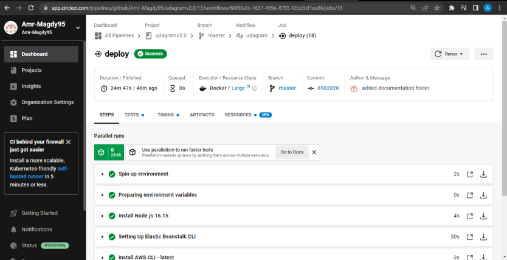
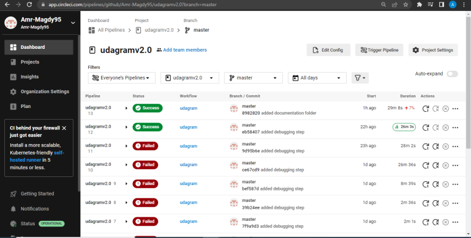
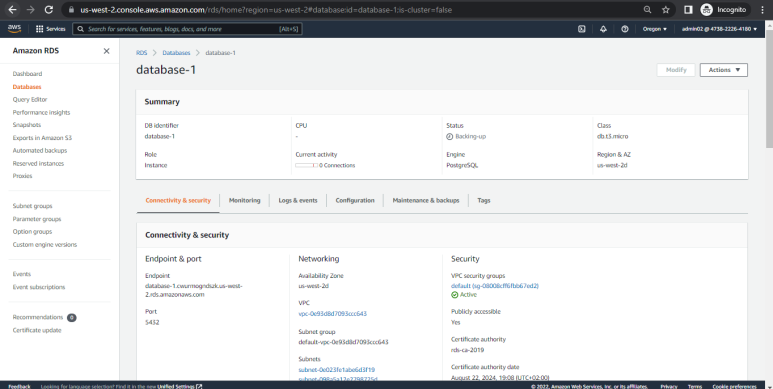
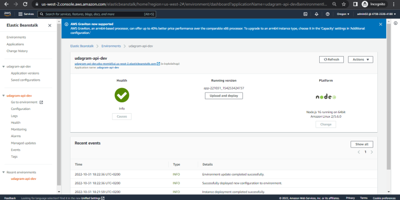
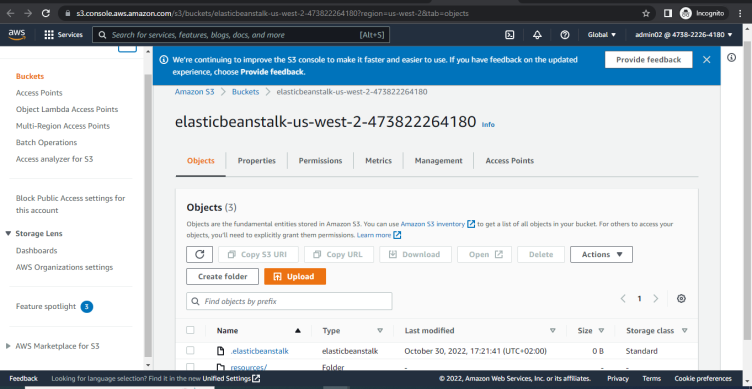
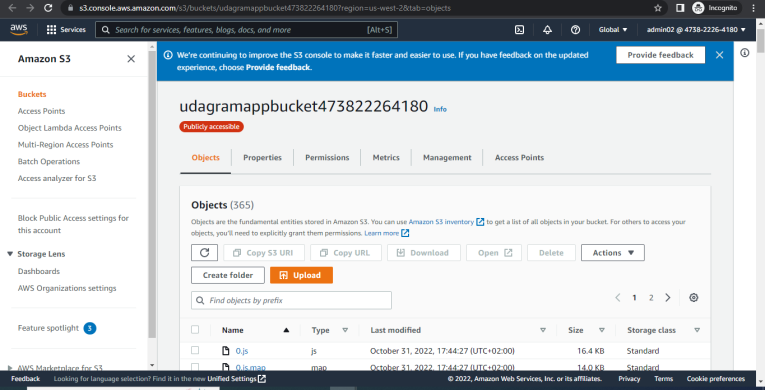
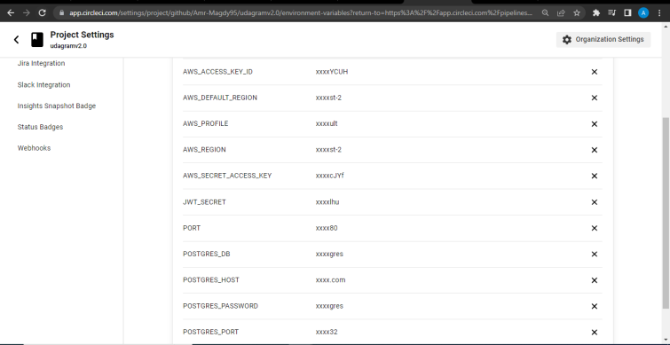

# Hosting a Full-Stack Application


# Udagram Links
- `http://udagramappbucket473822264180.s3-website-us-west-2.amazonaws.com/home`
- `http://udagram-api-dev.eba-mxmid5ui.us-west-2.elasticbeanstalk.com/`

# Udagram AWS Images









### Dependencies

```
- Node v14.15.1 (LTS) or more recent. While older versions can work it is advisable to keep node to latest LTS version

- npm 6.14.8 (LTS) or more recent, Yarn can work but was not tested for this project

- AWS CLI v2, v1 can work but was not tested for this project

- A RDS database running Postgres.

- A S3 bucket for hosting uploaded pictures.

```


## Built With

- [Angular](https://angular.io/) - Single Page Application Framework
- [Node](https://nodejs.org) - Javascript Runtime
- [Express](https://expressjs.com/) - Javascript API Framework

## License

[License](LICENSE.txt)
